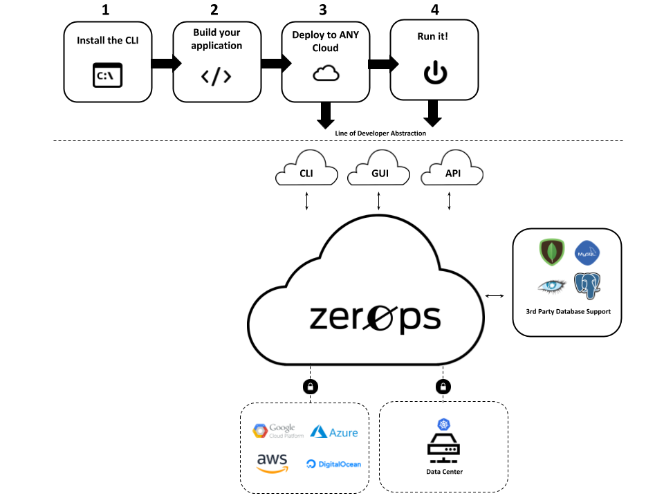

ZeroOps, is a Serverless Software Development Platform that allows developers to
run functions and microservices on any cloud, consumed as-a-service, increasing
deployment speed by 20% and reducing operational costs by X. ZeroOps is focused
on helping organizations increase velocity and save operations costs by
eliminating the need for operations in the day-to-day SDLC.

### Features

**Unmatched native performance**
Up to 20x faster than AWS Lambda

**Built-in test automation**
Choose to deploy only if tests pass

**Schedule periodic runs**
In plain English or Cron syntax

### Benefits

**No Ops -** developers are completely abstracted away from the operations of
apps. Developers deploy code and ZerOps runs, scales and manages application
based on demand. The developer experience is completely serverless, meaning that
they can focus on shipping code and not worry about containers, servers and
networks.

**Lightning Fast, Low latency code execution** allows developers to deploy
functions and microservices over 20% faster than any other serverless offering.
:+1:

**Deploy on any cloud -**  ZerOps can deploy to any Kubernetes cluster which
eliminates cloud lock-in and allows organizations to choose the cloud of best
fit for an application.

### Product Components

**Cloud-based Serverless Platform** automates all server side operations, enabling
developers to deploy functions and distributed web apps on any cloud.

**Client Side CLI** takes care of everything you need in order to write and deploy code.

**Powerful extensions** integrate the CLI with popular developers tools, so they never leave them.
